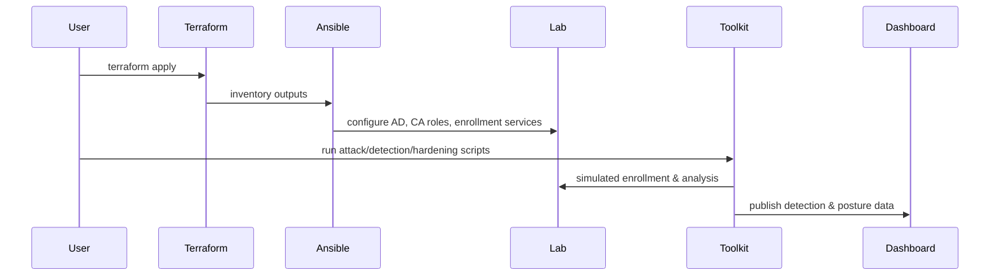

# Architecture & Design Overview

## Goals
- Provide a realistic yet safe ADCS lab for practicing attack and defence.
- Automate build-out with Terraform/Ansible scaffolds.
- Offer detection, hardening, and visualization modules for analysts and administrators.

## Components

### Infrastructure (IaC)
- **Terraform** provisions an isolated network, Windows domain controller, enterprise root CA, subordinate CA, web enrollment host, workstations, and servers.
- **Ansible** configures AD roles, CA services, enrollment web services, logging, and hardened baselines (firewalls, WinRM restrictions, mTLS stubs).

### Simulation Layer
- **Attack Modules** simulate ESC1–ESC8 behaviors, PKINIT abuse, shadow credentials, and NTLM relay in a controlled manner.
- **Detection Toolkit** enumerates certificate templates, EKUs, NTAuth store, and AD permissions via PowerShell and Python.
- **Defence Modules** apply mitigations: EKU validation, subject name lockdown, manager approvals, NTAuth hygiene, and legacy protocol disablement.

### Observability
- **Dashboard** (static HTML/JS) visualizes PKI hierarchy, template risk, detections, and hardening score.
- **Log Parsers** ingest Windows event logs, Sysmon, and ADCS events for SIEM-ready signals.

## Data Flow

## Security Considerations
- All scripts operate on synthetic data or isolated lab nodes; they never contact production services.
- Input validation is enforced in Python modules; YAML configs are parsed with `safe_load`.
- Logging is enabled for transparency; secrets are never stored in the repo.

## Extensibility
- Add new ESC modules under `attacks/` and corresponding detectors under `detection/`.
- Extend Terraform with providers for your hypervisor/cloud while keeping networks isolated.
- Expand dashboard data sources to ingest real-time logs from the lab SIEM stack.
