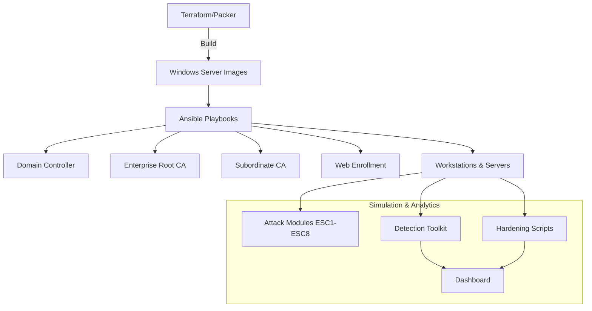

# Active Directory Certificate Services (ADCS) Attack & Defence Lab

A fully self-contained, SAFE simulation of enterprise PKI misconfigurations, attack paths, and defensive controls for Active Directory Certificate Services. The lab is designed for isolated environments only and ships with automation scaffolds, attack simulations, detection tooling, hardening scripts, and a lightweight dashboard.

## Quickstart (Local Simulation)

1. **Install Python 3.10+** and install dependencies:
   ```bash
   make install  # installs runtime + dev tooling
   ```
2. **Use the unified CLI** (safe, local-only):
   ```bash
   # ESC1 simulation for requester "alice"
   adcs-lab --config data/sample_templates.yaml simulate --requester alice

   # Scan for misconfigured templates (prints table + JSON)
   adcs-lab detect --output-json

   # Apply EKU/permission hardening and emit JSON
   adcs-lab harden --output-json
   ```
   Exit codes mirror other wrappers in `attacks/`, `detection/`, and `defence/`:
   - `0` success, `1` requester missing or no actions/findings, `2` blocked simulation, `3` config load error.
3. **Open the dashboard** by loading `dashboard/index.html` in a browser to view the PKI map, detections, and hardening score.

> **Safety Note:** All artifacts are simulations and never connect to real AD/PKI systems.
> **Config Integrity:** The CLI validates configuration files for duplicate names and invalid CA parent references to prevent ambiguous lab states.

## Architecture Overview



- **Infrastructure**: Terraform + Ansible scaffolds create an isolated lab with domain controller, enterprise root CA, subordinate CA, web enrollment, and member servers.
- **Attack Modules**: Safe simulations for ESC scenarios and certificate abuse pathways.
- **Detection Toolkit**: PowerShell/Python scripts to enumerate templates, NTAuth store, EKUs, and permission risks.
- **Defence Modules**: Hardening controls aligned to Zero Trust (mTLS, EKU validation, manager approval, NTAuth hygiene).
- **Dashboard**: Static HTML/JS visualiser for PKI hierarchy, detections, and hardening score.

## Repository Structure

- `infra/terraform/` – Terraform skeleton for lab provisioning (local hypervisor/cloud-agnostic).
- `infra/ansible/` – Ansible inventory and playbooks to configure AD, CA roles, and endpoints.
- `infra/scripts/` – Helper scripts for variable generation and lab hygiene.
- `attacks/` – Safe attack simulations (ESC1 implemented, stubs for expansion).
- `detection/` – Detection and enumeration tooling (PowerShell + Python).
- `defence/` – Hardening scripts focused on EKU/permissions lockdown.
- `dashboard/` – Visualiser assets for PKI graph and detections.
- `docs/` – Training guides, architecture, and playbooks.
- `docs/DEVELOPMENT.md` – Contribution quality gates, style, and security posture for maintainers.
- `tests/` – Pytest suite for simulation and hardening logic.

## Lab Automation (Terraform + Ansible)

1. Copy `infra/terraform/terraform.tfvars.example` to `terraform.tfvars` and adjust local hypervisor settings.
2. Run Terraform to build isolated Windows nodes:
   ```bash
   cd infra/terraform
   terraform init
   terraform plan
   terraform apply
   ```
3. Execute Ansible to configure roles (requires WinRM to lab hosts):
   ```bash
   cd ../ansible
   ansible-playbook -i inventory.ini setup-lab.yml
   ```

> The IaC is intentionally cloud-neutral and expects users to supply base Windows images available only to their isolated lab. No public networks are touched.

## Security & Zero Trust

- All content is **simulation-only** and safe for offline labs.
- Hardening guidance aligns with Microsoft Zero Trust for PKI: enforce mTLS, constrain EKUs, require approvals, curate NTAuth, and disable legacy protocols.
- Detection rules focus on ESC1–ESC8 indicators, template abuse, and anomalous enrollments.

## Contributing

See [CONTRIBUTING.md](CONTRIBUTING.md) for guidelines. Please adhere to the [Code of Conduct](CODE_OF_CONDUCT.md).

## Local Development

- Run `make lint` for flake8, Black (check), and mypy.
- Run `make test` for the full pytest suite.
- Formatting is opinionated via Black; see [docs/DEVELOPMENT.md](docs/DEVELOPMENT.md) for details.

## License

MIT License. See [LICENSE](LICENSE).
